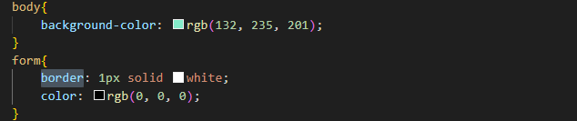

# projeto-login
Projeto criado como parte avaliativa da disciplina de Fundamentos de Desenvolvimento Web ministrada pelo professor Leonardo Rocha.
 
## Ìndice
 
* [Descrição](#descrição)
* [Tecnologias](#tecnologia)
* [Referencia](#referência)
* [Autor(a)](#autora)
 
### Descrição
O projeto consiste em uma tela de formulario básico, onde é possivel mandar uma mensagem de contato onde é 
possivel adicionar o nome, telefone, e-mail, o tema da mensagem que sera encaminhada e o espaço para ser digitada a mensagem.
 

 
#### Tela form
  A seguir será possivel visualizar os elementos usados na estrutura HTML do arquivo:
  

* `Main`: Entende-se como conteúdo principal aquele relacionado diretamente com o tópico central da página ou com a funcionalidade central da aplicação.

* `label` : Ela especifica qual o “rótulo” do input (a que se refere o input, como, por exemplo, envolvê-la em um texto “Nome completo”), e ajuda na experiência do usuário e usuária durante a utilização e preenchimento do formulário.

* `form`: O elemento <form> é o elemento que formalmente define o formulário e os atributos que definem a maneira como esse formulário se comporta. 

Veja a imagem a seguir onde sera possivel ver os elementos mencionados acima: 

* `input`: Componente que permite a entrada de dados textuais por parte do usuário.

* `textarea`- é um campo de entrada de texto que permite que seu aplicativo aceite um valor de texto potencialmente longo do usuário.

* `button`-representa um botão clicável.

Veja a imagem a seguir onde é possivel visualizar os elementos mencionados acima:

 
### Propriedades CSS
 
* `background-color` - define a cor de fundo de um elemento.

* `color`: O tipo de dado CSS <color> indica um cor no espaço sRGB . Uma cor pode ser descrita em qualquer uma destas formas:

* `Border`: A propriedade border adiciona um contorno ao redor do conteúdo do elemento HTML.
 
 Veja a imagem a seguir onde é possivel visulizar os elemntos mencionados acima:

 * `width` : A propriedade CSS width determina a largura da área de conteúdo de um elemento

 * ``height``: A propriedade "height" no HTML é utilizada para definir a altura de um elemento. 

 * `font-weight`: A propriedade font-weight é utilizada para aplicar ou remover negrito de um elemento de texto.
 
### Resultado do projeto

Veja a seguir a imagem onde é possivel ver o resultado final do projeto:

 
## Tecnologia

A seguir estará listado as tecnologias que foi utilizadas para este arquivo:

* HTML5
* CSS3
* GIT
* GITHUB
 
## Referência
[Alura](https://www.alura.com.br/artigos/como-criar-um-readme-para-seu-perfil-github) Como criar um README para o seu perfil do GitHub

## Autor(a) 

`Este projeto foi desenvolvido por:`

Willian Almeida.

