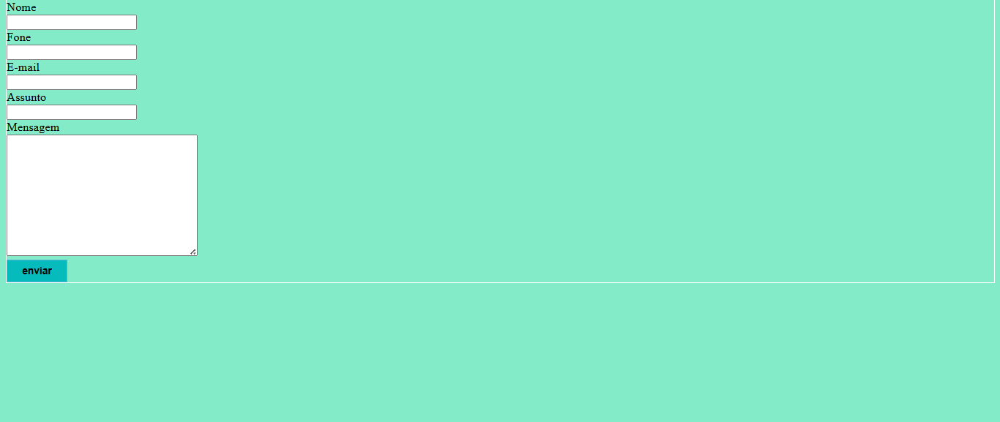
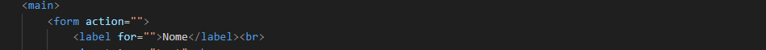
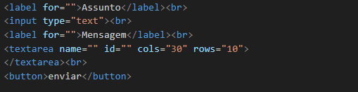

# projeto-login
Projeto criado como parte avaliativa da disciplina de Fundamentos de Desenvolvimento Web ministrada pelo professor Leonardo Rocha.
 
## Ìndice
 
* [Descrição](#descrição)
* [Tecnologias](#tecnologia)
* [Referencia](#referência)
* [Autor(a)](#autora)
 
### Descrição
O projeto consiste em uma tela de formulario básico, onde é possivel mandar uma mensagem de contato onde é 
possivel adicionar o nome, telefone, e-mail, o tema da mensagem que sera encaminhada e o espaço para ser digitada a mensagem.
 
### Resultado do projeto

Veja a seguir a imagem onde é possivel ver o resultado final do projeto:


 
#### Tela form
  A seguir será possivel visualizar os elementos usados na estrutura HTML do arquivo:
  

* `Main`: Entende-se como conteúdo principal aquele relacionado diretamente com o tópico central da página ou com a funcionalidade central da aplicação.

* `label` : Ela especifica qual o “rótulo” do input (a que se refere o input, como, por exemplo, envolvê-la em um texto “Nome completo”), e ajuda na experiência do usuário e usuária durante a utilização e preenchimento do formulário.


* `form`: O elemento <form> é o elemento que formalmente define o formulário e os atributos que definem a maneira como esse formulário se comporta. 

Veja a imagem a seguir onde sera possivel ver os elementos mencionados acima: 



* `input`: Componente que permite a entrada de dados textuais por parte do usuário.

* `textarea`- é um campo de entrada de texto que permite que seu aplicativo aceite um valor de texto potencialmente longo do usuário.

* `button`-representa um botão clicável.

Veja a imagem a seguir onde é possivel visualizar os elementos mencionados acima:




 
 
### Propriedades CSS
 
* `Display` - define se um elemento é tratado como um bloco ou elemento inline e o layout usado para seus filhos, como layout de fluxo, grid ou flex.
 
* `justify-conten` - define como o navegador distribui o espaço entre e ao redor dos itens de conteúdo ao longo do eixo principal de um contêiner flexível e do eixo embutido dos contêineres de grade e multicol.
 
* `align-items` - define o valor em todos os filhos diretos como um grupo. No flexbox, ele controla o alinhamento de itens no eixo cruzado . No layout de grade, ele controla o alinhamento de itens no eixo de bloco dentro de suas áreas de grade.
 
* `background-image` - define uma ou mais imagens de fundo em um elemento.
 
* `background-color` - define a cor de fundo de um elemento.
 
* `padding` -O preenchimento é usado para criar espaço ao redor do conteúdo de um elemento, dentro de quaisquer bordas definidas.
 
 * `padding-top`- A propriedade CSS define a altura da área de preenchimento na parte superior de um elemento.padding-top
 
* `border-radius`- arredonda os cantos da borda externa de um elemento. Você pode definir um único raio para fazer cantos circulares, ou dois raios para fazer cantos elípticos.
 
* `color` - O tipo de dado CSS <color> indica um cor no espaço sRGB . Uma cor pode ser descrita em qualquer uma destas formas:
 
* `box-shadow` -  é utilizado para adicionar efeitos de sombra em volta de um elemento. Você pode especificar mais de um efeito, os separando com virgulas.
 
 
 
#### RESULTADO
 
 

 
 
 
 
### estilização
  O projeto foi estilizado, utilizando css, foi criado um arquivo
  chamado login.css. Nesse arquivo, constam configurações de estilo
  apresentadas a seguir:
 
  * Estilo de cores- A cor de fundo do projeto foi definida como segue:
 
```
.form {
    background-image: linear-gradient(150deg, #3693a3 0, #93bef0 16.67%, #bfceee 33.33%, #3e667c 50%, #a9d2e2 66.67%, #96bddd 83.33%, #537a8a 100%);
    background-color: #3dcefa;
    padding: 30px;
    padding-top: 0;
    border-radius: 20px;
    color: rgb(68, 83, 116);
    box-shadow: 0 0 10px black;
}
 
```
 
 
## Tecnologia
* HTML5
* CSS3
* README
* GIT
* GITHUB
 
## Referência
[display](https://developer.mozilla.org/pt-BR/docs/Web/CSS/display)
[justify-conten](https://developer.mozilla.org/en-US/)
[align-items](https://developer.mozilla.org/en-US/)
[background-image](https://developer.mozilla.org/en-US/)
[background-color](https://developer.mozilla.org/en-US/)
[padding](https://developer.mozilla.org/en-US/)
[padding-top](https://developer.mozilla.org/en-US/)
[border-radius](https://developer.mozilla.org/en-US/)
[color](https://developer.mozilla.org/en-US/)
[box-shadow](https://developer.mozilla.org/en-US/)
 
## Autor(a)


